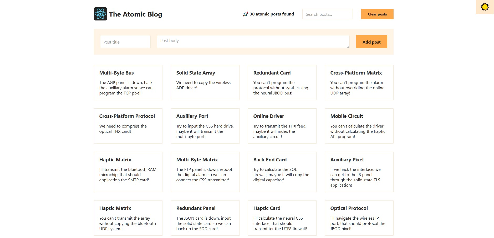
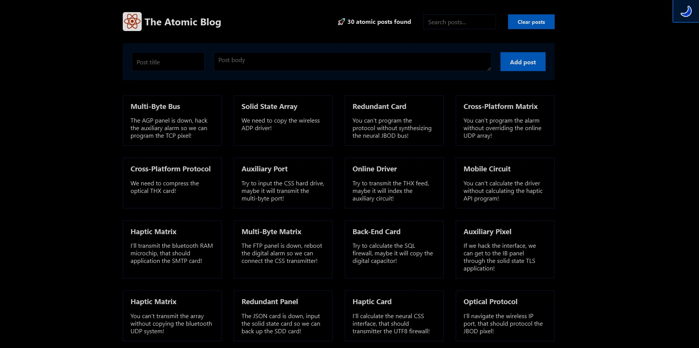

# ⚛ The Atomic Blog

<h1 align="center">
    
    
</h1>

## What is Atomic Blog?

His react project is from the current ultimate-react-course that I'm taking. Check out the instructor: <a href="https://github.com/jonasschmedtmann">Jonas Schmedtmann</a>. It is a React application that allows users to create, search, and manage blog posts. It features a dark mode toggle, search functionality, and the ability to add and clear posts. Users can also view

### Technologies Used
 👉 React for the UI structure, leveraging hooks and components.
 👉 Context API for state management, particularly for handling blog post data and user preferences.

### Optional Enhancements
 👉 Dark Mode: A toggle feature for users to switch between light and dark themes.
 👉 Rich Editor with Plugins: Enhanced editor with plugins for easy embedding of social posts.

---

# Important

:key: Take a look --> https://bishoylabib7.github.io/atomic-blog/

## :rocket: Technologies used:

<a href="https://developer.mozilla.org/en-US/docs/Web/HTML" target="_blank" rel="noreferrer"> 
<a href="https://developer.mozilla.org/en-US/docs/Web/CSS" target="_blank" rel="noreferrer"> 
<a href="https://developer.mozilla.org/en-US/docs/Web/JavaScript" target="_blank" rel="noreferrer"> 
 <a href="https://react.dev/" target="_blank" rel="noreferrer">  

You can use any tools you like to help you complete the challenge. So if you've got something you'd like to practice, feel free to give it a go.

---

## About

this project was developed in "The Ultimate React Course 2024: React, Next.js, Redux & More" Course ! 
https://www.udemy.com/course/the-ultimate-react-course/?couponCode=JUST4U02223

Created by **<a href="https://github.com/jonasschmedtmann">Jonas Schmedtmann</a>**  
